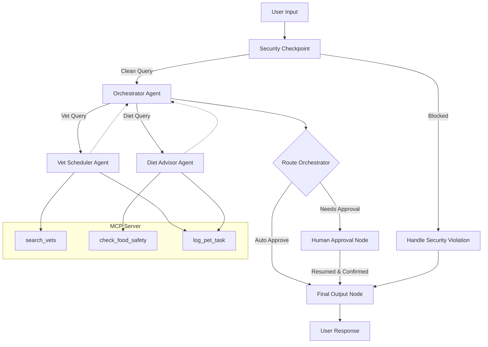

# ADK Submission Write-up — pet-care

## Problem Statement
Pet owners often struggle to manage multiple aspects of pet care simultaneously, such as scheduling vet appointments, verifying the safety of human food for their pets, and tracking completed tasks (e.g., vaccine doses or medication). These tasks are spread across disjointed systems. An intelligent, secure, and integrated concierge agent is needed to automate schedule checks, query food safety metrics, log tasks, and request human verification for scheduling actions.

## Solution Architecture

## Concepts Used & Code References
* **ADK Workflow**: Configured in [agent.py](file:///d:/adk%20workspace/pet-care/app/agent.py#L182-L208). Defines the graph structure directing nodes and routes.
* **LlmAgent**: Constructed for specialized sub-tasks (`vet_scheduler_agent`, `diet_advisor_agent`) and coordination (`orchestrator_agent`) in [agent.py](file:///d:/adk%20workspace/pet-care/app/agent.py#L77-L121).
* **AgentTool**: Used by `orchestrator_agent` to delegate queries to specialized sub-agents in [agent.py](file:///d:/adk%20workspace/pet-care/app/agent.py#L117-L120).
* **MCP Server**: Structured using FastMCP stdio transport in [mcp_server.py](file:///d:/adk%20workspace/pet-care/app/mcp_server.py).
* **Security Checkpoint**: Implemented as the `security_checkpoint` node in [agent.py](file:///d:/adk%20workspace/pet-care/app/agent.py#L124-L167) to sanitize inputs.
* **Agents CLI**: Project scaffolded and managed using the `agents-cli` toolset.

## Security Design
* **PII Scrubbing**: Regular expressions detect and replace email addresses and phone numbers. This prevents exposing owner contact information to LLM backends or logs.
* **Prompt Injection Defense**: Keyword scanning blocks input attempts to override system instructions.
* **Domain Content Rule**: Blocks exotic/dangerous pet requests (e.g. tigers, cobras) to keep the concierge focused on domestic pets.
* **Audit Logging**: Every incoming query creates a structured JSON entry grading severity (`INFO`, `WARNING`, `CRITICAL`), ensuring a clear logging audit trail.

## MCP Server Design
* `search_vets`: Queries veterinarian contact information by zip code.
* `check_food_safety`: Verifies toxicity levels of specific foods for dogs and cats.
* `log_pet_task`: Persists a logged log string to a local database (`pet_care_tasks.db`) containing pet name, task, and description.

## Human-in-the-Loop (HITL) Flow
To prevent accidental or incorrect vet bookings, the scheduling route requires explicit user confirmation.
* **Pause Node**: `human_approval_node` yields a `RequestInput` object displaying the appointment details.
* **Resume**: When the user provides input (`yes`/`no`), the node reruns with `rerun_on_resume=True`, evaluates the user's consent, and logs the appointment to the database upon approval.

## Demo Walkthrough
* **Test Case 1: Vet Booking (HITL)**: User asks to schedule a vet visit for Buddy. The system prompts for confirmation, user responds `"yes"`, and the scheduler logs the task.
* **Test Case 2: Diet Checker**: User asks if chocolate is safe for a puppy. The advisor uses `check_food_safety` to flag toxicity and recommends puppy formula directly.
* **Test Case 3: Injection Attack**: User prompts to ignore system instructions. The security checkpoint catches it and blocks the request.

## Impact & Value Statement
This multi-agent concierge simplifies pet health and safety management for pet owners by combining vet availability, food safety, and task logging into a unified chat interface, protected by robust data safety controls.
